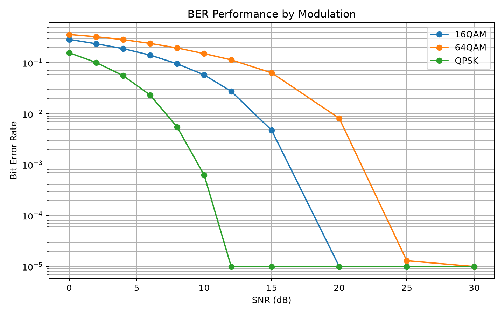
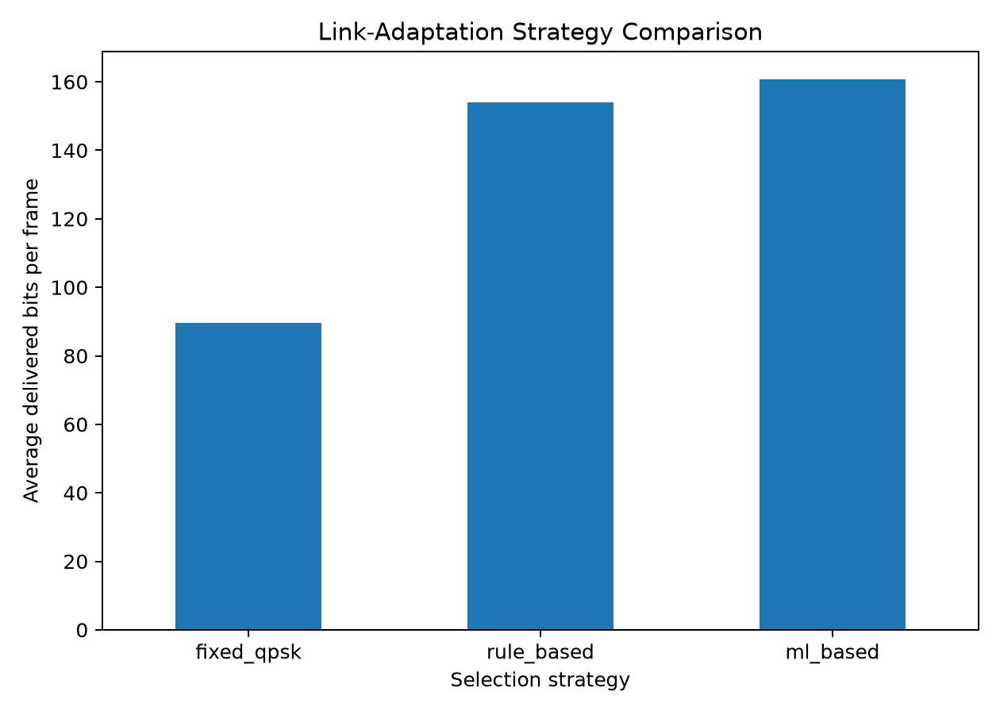
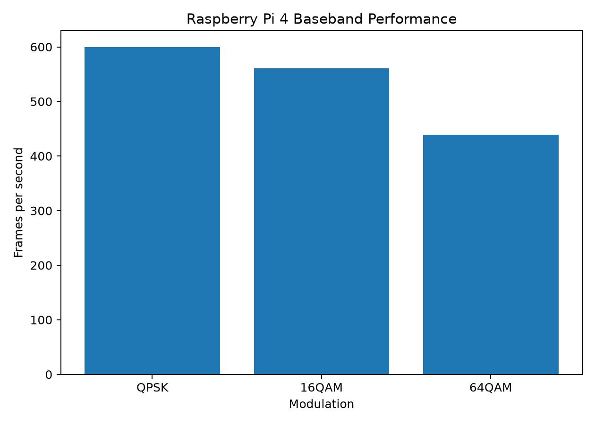

# AI-Driven 5G Baseband Processing on Raspberry Pi

A software-only, NR-inspired OFDM simulator combining digital signal
processing, machine-learning link adaptation, fault diagnosis,
automated testing, and Raspberry Pi deployment.

## Features

- QPSK, 16-QAM, and 64-QAM modulation
- OFDM modulation and demodulation
- Cyclic-prefix processing
- AWGN and flat Rayleigh fading
- Narrowband tone interference
- Pilot-based channel estimation
- One-tap equalization
- BER, EVM, and pilot-error measurement
- ML-based adaptive modulation
- ML-assisted fault diagnosis
- Streamlit dashboard deployed on Raspberry Pi 4

## Signal path

    Random bits
    → QPSK / 16-QAM / 64-QAM
    → OFDM resource grid with pilots
    → IFFT and cyclic prefix
    → Fading, interference, and AWGN
    → Cyclic-prefix removal and FFT
    → Pilot-based channel estimation
    → Equalization and demapping
    → BER, EVM, and ML analysis

## Machine-learning results

- Link-adaptation accuracy: **94.2%**
- Fault-classification accuracy: **97.8%**
- Verified pilot-corruption diagnosis confidence: **99.6%**

The link-adaptation model selects QPSK, 16-QAM, or 64-QAM using:

- SNR
- Probe BER
- Probe EVM
- Packet-error rate
- Pilot-error percentage
- Estimated channel magnitude

The fault classifier identifies:

- `NONE`
- `SYMBOL_GAIN_ERROR`
- `PILOT_CORRUPTION`
- `CHANNEL_ESTIMATION_BIAS`
- `EQUALIZER_BYPASS`
- `IQ_SWAP`

## Raspberry Pi 4 benchmark

| Operation | Mean latency | Throughput |
|---|---:|---:|
| QPSK frame | 1.67 ms | 599.48 frames/s |
| 16-QAM frame | 1.78 ms | 560.56 frames/s |
| 64-QAM frame | 2.28 ms | 439.03 frames/s |
| ML selection | 3.90 ms | 256.10 inferences/s |

Caching the trained model reduced modulation-selection latency from
approximately 13.9 ms to 3.9 ms.

## Repository structure

    src/
    ├── channel/
    ├── metrics/
    ├── ml/
    ├── receiver/
    ├── transmitter/
    ├── fault_injection.py
    └── link_simulator.py

    dashboard/
    datasets/
    models/
    results/
    scripts/
    tests/

## Setup

    git clone git@github.com:Alison0704/ai-5g-baseband-pi.git
    cd ai-5g-baseband-pi

    python3 -m venv .venv
    source .venv/bin/activate
    pip install -r requirements.txt

## Run the tests

    python -m pytest -v

## Run the dashboard

    make dashboard

Open locally:

    http://localhost:8501

The Raspberry Pi deployment is available on the local network at:

    http://ai5gpi.local:8501

## Raspberry Pi service

The Streamlit dashboard starts automatically through `systemd`.

Check its status with:

    systemctl status ai5g-dashboard --no-pager

Useful service commands:

    sudo systemctl restart ai5g-dashboard
    sudo systemctl stop ai5g-dashboard
    sudo systemctl start ai5g-dashboard

## Generate datasets and train models

    make dataset
    make train

Run the link-adaptation comparison:

    make regression

Run the system benchmarks:

    make benchmark

## Scope

This is an educational, NR-inspired wireless simulator. It is not a
complete standards-compliant 5G NR gNodeB implementation.

The current implementation uses:

- Single-symbol OFDM frames
- Flat fading
- Hard-decision demapping
- Pilot-based flat-channel estimation
- Lightweight edge-deployable ML models

## Resume summary

- Developed an NR-inspired OFDM simulator supporting QPSK, 16-QAM, and
  64-QAM under noise, fading, and interference.
- Trained lightweight ML models for adaptive modulation and baseband
  fault diagnosis.
- Implemented automated unit, integration, and fault-injection tests.
- Deployed the simulator, ML inference pipeline, monitoring dashboard,
  and automatic startup service on a Raspberry Pi 4.

## Results

### Modulation performance

### Link-adaptation comparison

### Raspberry Pi performance

